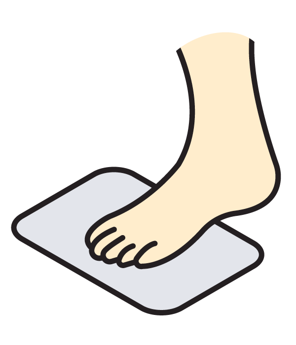

<h1 align="center">Native Trackpad Gestures for Autodesk Fusion 360</h1>

Fix annoying gesture navigation in Fusion 360 on macOS

## What it does?

This add-in fixes two finger pan and pinch to zoom gestures where gestures are not being recognized or where they are slow. On top of that it adds inertia to two finger pan. This is done by replacing Fusion's gesture recognizer with macOS native recognizer.

## Features

- Two finger pan **with inertia**
- Pinch to zoom
- Rotate view (shift + two finger)

## More info

- [**Play video**](https://www.youtube.com/watch?v=7M2McvpOL90)
- [Todos](https://github.com/pravdomil/Native-Trackpad/search?q=todo)
- [Issues](https://github.com/pravdomil/Native-Trackpad/issues)
- [Letter](https://medium.com/@smenor/an-open-letter-to-the-next-ceo-of-autodesk-310c02dd5607#9844)
- [IdeaStation](https://forums.autodesk.com/t5/ideastation-request-a-feature-or/use-native-trackpad-gesture-recognition-on-macos/idi-p/7018667)
- [**Donate**](https://www.paypal.com/cgi-bin/webscr?cmd=_s-xclick&hosted_button_id=BCL2X3AFQBAP2&item_name=NativeTrackpad%20beer)

## App Store install

- [Go to Fusion 360 App Store](https://apps.autodesk.com/FUSION/en/Detail/Index?id=2223881439415941299)
- Press Download button on right side
- Launch installer
- Follow installer instructions

## Manual install

*App Store installer can be broken (is made and managed by Autodesk) but you can install add-in manually.*

- [Download latest release](https://github.com/pravdomil/Native-Trackpad/releases/download/0.11/NativeTrackpad.zip)
- Unzip
- Go to Fusion → Scripts and Add-ins → Press green **+**
- Select unzipped folder
- Done!

## Trackpad configuration

In Fusion make sure to turn on `Use gesture-based view navigation`. There is not special needs to configure your Trackpad in System Preferences. What I personaly do is set Tracking speed to maximum to have panning even faster. That's all.
