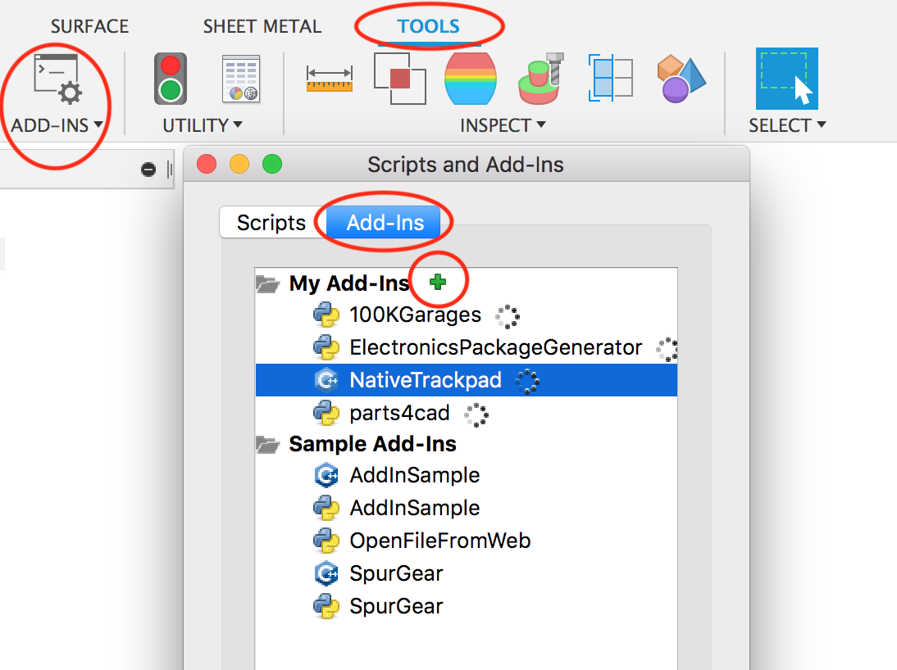

# Native Trackpad Gestures for Autodesk Fusion 360

Fix annoying gesture navigation in Fusion 360 on macOS

## What it Does?

This add-in fixes two finger pan and pinch to zoom gestures where gestures are
not being recognized or where they are slow. On top of that it adds inertia to
two finger pan. This is done by replacing Fusion's gesture recognizer with macOS
native recognizer.

## Features

- Two finger pan **with inertia**
- Pinch to zoom
- Rotate view (shift + two finger)
- Zoom to fit (double two finger tap)

## Know Issues

- works only in Fusion 360 downloaded from AppStore 
- you can't no longer scroll in Data panel, in order to scroll press and hold Command key
- navigation with perspective camera can become very slow in certain situations, switch to orthographic camera that's more reliable, you can check [code that causes this issue](https://github.com/pravdomil/Native-Trackpad/blob/563fc1f69e3eb2f6dbee136feb9e3b52e439e907/NativeTrackpad.mm#L56)

## More Info

- [**Play video**](https://www.youtube.com/watch?v=7M2McvpOL90)
- [Todos](https://github.com/pravdomil/Native-Trackpad/search?q=todo)
- [Issues](https://github.com/pravdomil/Native-Trackpad/issues)
- [Letter](https://medium.com/@smenor/an-open-letter-to-the-next-ceo-of-autodesk-310c02dd5607#9844)
- [IdeaStation](https://forums.autodesk.com/t5/ideastation-request-a-feature-or/use-native-trackpad-gesture-recognition-on-macos/idi-p/7018667)
- [**Donate**](https://www.paypal.com/cgi-bin/webscr?cmd=_s-xclick&hosted_button_id=BCL2X3AFQBAP2&item_name=NativeTrackpad%20beer)

## How to Install

- [Download latest release](https://github.com/pravdomil/Native-Trackpad/releases/download/0.13/NativeTrackpad.zip)
- Unzip
- Go to Fusion → Scripts and Add-ins → Press green **+**
- Select unzipped folder
- In Fusion make sure to turn on `Use gesture-based view navigation`. There is no special needs to configure your Trackpad in System Preferences. What I personaly do is set Tracking speed to maximum to have panning even faster.

